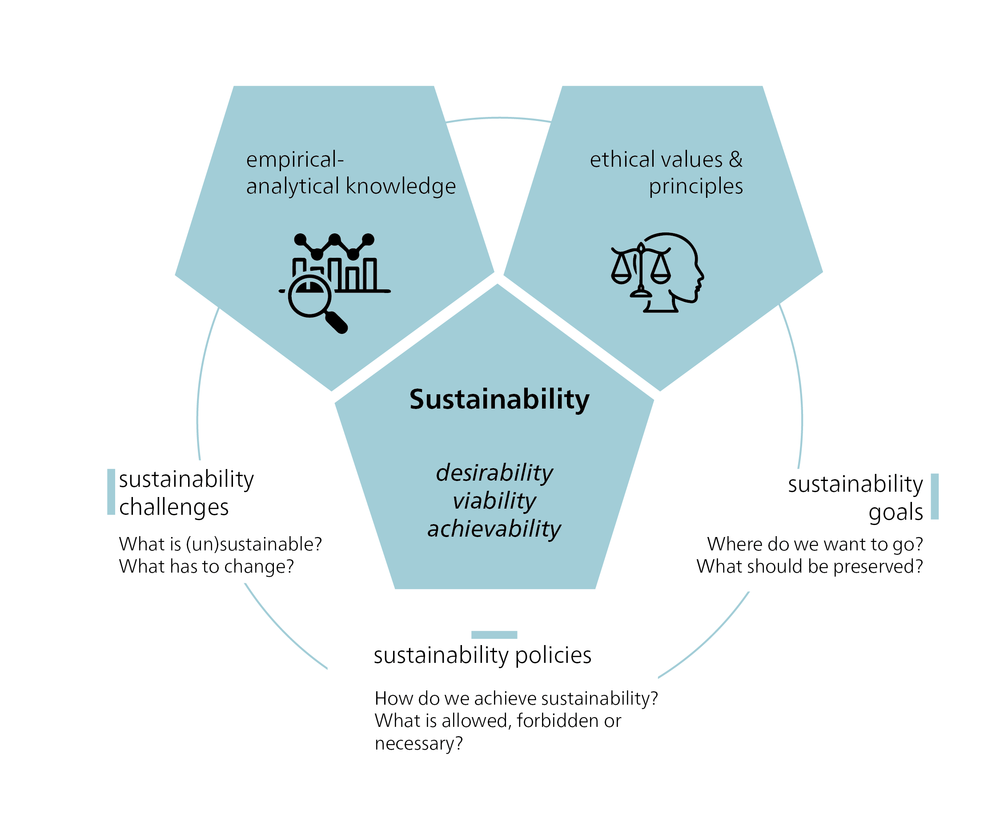
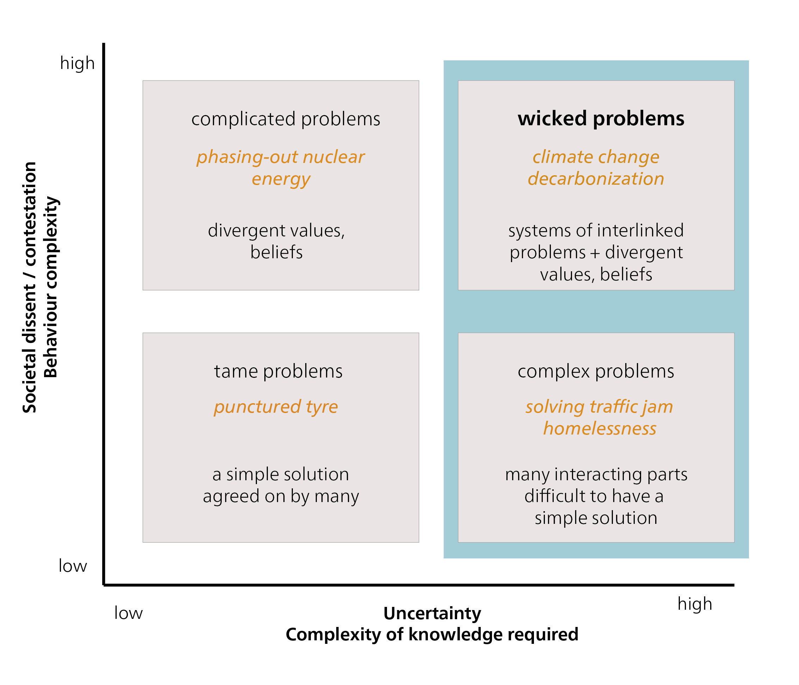
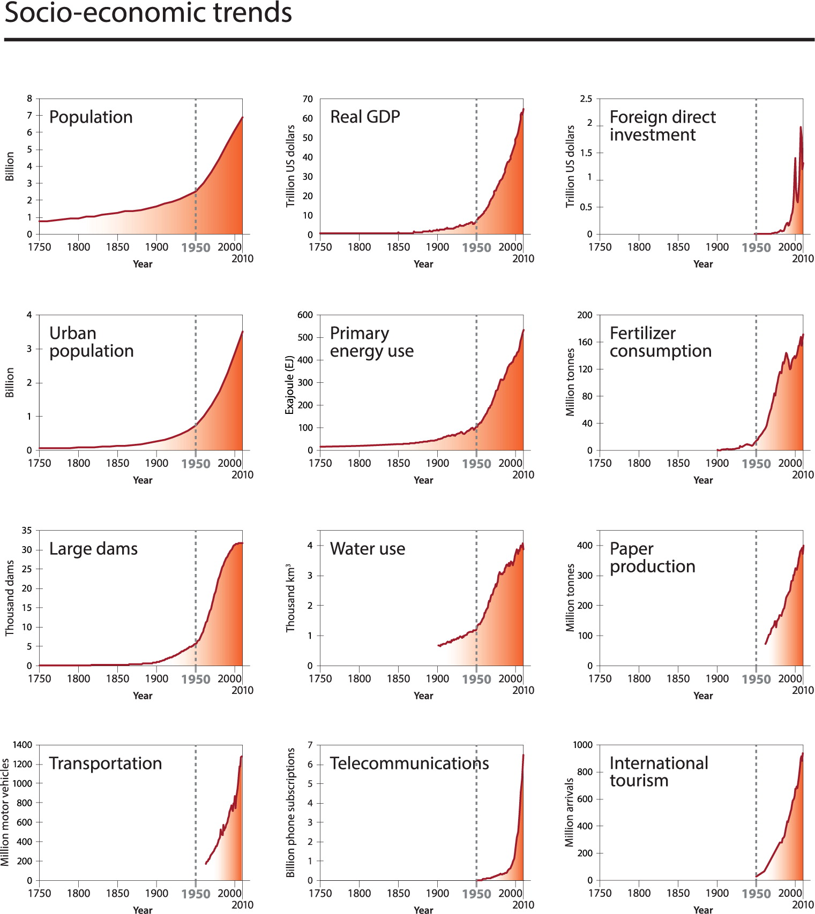
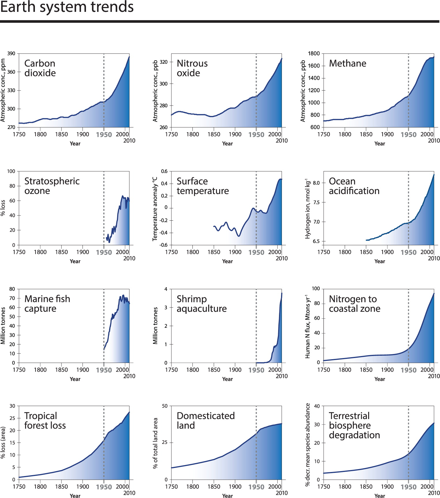
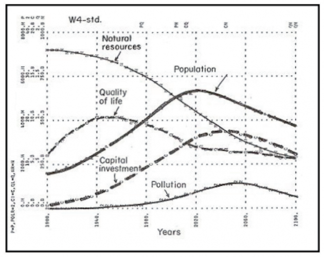
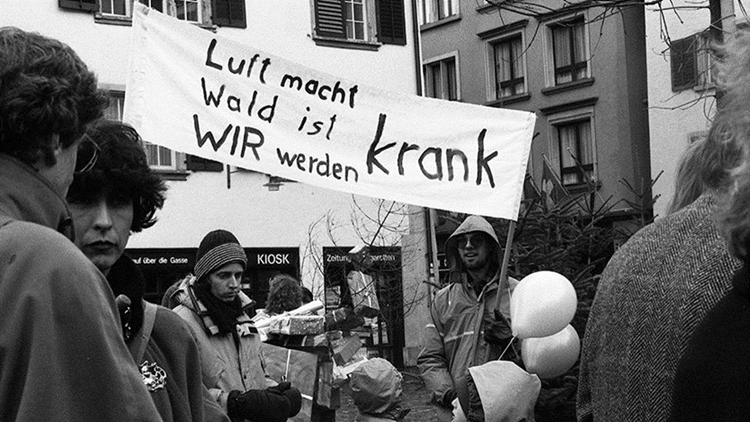

## A normative concept

{#fig-sd-normative}

To achieve sustainability, we need **sustainable development**: a strategic process that requires changes in our socio-ecological systems and institutions. “Development” implies controlled improvement, and the ethical question of what exactly “better” means is key. The use of the term “development” has been criticized by some [e.g. @langDevelopmentAlternativeVisions2013; @kothariPluriversePostdevelopmentDictionary2019], as it is often equated with unbridled growth. The unbridled growth of our “ecological footprint” -- the proportion of the biosphere used for human production, consumption, and waste -- is unsustainable in the long term. Nonetheless, there are different interpretations of development, ranging from economic growth to improving quality of life. Sustainable development therefore remains a stimulating and controversial concept. Sustainability and sustainable development play a key role in today’s political discourse. The term **unsustainability** refers to conditions or developments that are considered negative, while **sustainability** represents a positive state.

The concept of sustainable development commits us to certain values and norms that define ethical goals and rules of behaviour. These values and norms shape our ideas of what we consider a desirable or “positive” change. A neutral point of view is not possible, as our perceptions are shaped by a variety of influences. Our personal experiences, upbringing, social environment, and cultural background all influence how we see and interpret the world, including our perceptions of what “should be” and what actions “should be taken”. Ethics play a key role in determining how the current situation can be improved to achieve sustainability, by defining normative goals and limits. Sustainable development is therefore a conceptual framework that is strongly driven by ethical considerations.

It follows that sustainability challenges such as poverty reduction and climate change are ethical challenges. The identification of situations as sustainability problems (and therefore as “negative”) and the choice of solutions are based on ethical values. Sustainability goals are also based on ethical values, as well as on knowledge of cause-and-effect relationships. Sustainability issues are often referred to as **wicked problems**, because of their complex and pluralistic nature. Global warming, in particular, has been described as a **super wicked problem**, as finding solutions is urgent, political institutions are often inadequate, and decision-making processes suffer from short-sightedness.

## Global challenges as wicked problems

Mike Hulme, author of *Why We Disagree About Climate Change* [-@hulmeWhyWeDisagree2009], suggests that we view climate change as a “wicked problem” of enormous scale and likely longevity. This approach helps us see climate change not as a problem that needs to be solved, but as a condition in which we are directly involved. The categorization of problems as “wicked”, i.e. those that do not lend themselves to clear-cut solutions, originated with the planning theorists Horst Rittl and Melvin Webber [-@rittelDilemmasGeneralTheory1973]. They argued that planners have to deal with unpredictable human behaviour, and that some problems are too complicated to be solved completely. Some “wicked problems” may never be fully solved, but we can learn to cope with them and not let them dominate us.

{#fig-WickedProblems}

::: {.callout-note collapse="true"}
##### Wicked problems

According to @banninkIntelligentModesImperfect2019, wicked problems arise at the intersection of factual uncertainty and a heterogeneity of preferences and interests. Wicked problems are characterized by [@alfordWickedLessWicked2017; @rittelDilemmasGeneralTheory1973; @sediriTransformabilityWickedProblem2020]:

- **Complexity**: Wicked problems are characterized by many interrelated factors and interactions. There are no clear cause-and-effect relationships, and changes in one area can have unforeseen effects in other areas.

- **Normative conflicts**: Wicked problems are perceived and interpreted differently by different stakeholders and interest groups. There is no clear definition or consensus on what exactly the problem is, or how it should be solved.

- **Interdisciplinarity**: Wicked problems require an interdisciplinary approach as they involve different topics, perspectives, and stakeholders. Finding a solution often requires the cooperation and coordination of different disciplines and experts.

- **Uncertainty**: Incorrect, missing, or inaccessible information about the problem situation and about the continuity of the values of the variables involved.

- **No definitive solution**: Wicked problems defy clear-cut solutions. They are dynamic, change over time, and require continuous adjustment and iterations.

Examples of wicked problems include climate change, poverty alleviation, global health, and sustainability. The complexity and interaction of different factors in these areas make it difficult to find simple and clear-cut solutions. Dealing with wicked problems requires a high degree of reflection, collaboration, and the use of systemic thinking methods.
:::

How have we maneuvered ourselves into the current situation, where wicked problems pose such a challenge to sustainable development? In this textbook, we will analyse and learn to understand three key global challenges:

- the emergence of human-induced global warming;

- the persistence of global poverty and rising inequalities;

- and the threat of species extinction and overexploitation of natural resources.

The debate about human influence on global warming and climate change has intensified since the publications of the Intergovernmental Panel on Climate Change (IPCC). The driving force behind global warming is our dependence on oil and other fossil fuels for transport, (electricity) generation, agriculture, and many everyday products. Another wicked problem is global poverty. Although there have been global efforts to reduce poverty for decades, the globalized market economy often leads to increased poverty in certain regions, and the gap between rich and poor seems to be widening overall [@chancelWorldInequalityReport2021]. High-income countries have maintained their prosperity and living standards at the expense of others. These are “externalized costs”, and they include environmental degradation. For example, the wealth and living standards of high-income countries are largely responsible for the threat of species extinction and the overuse of natural resources [@lessenichNebenUnsSintflut2018]. In addition to the above mentioned “big three” -- climate change, poverty, and biodiversity loss -- there are many other global sustainability challenges, such as deforestation, desertification, declining soil fertility, dwindling fish stocks, pollution, wars, conflicts, and increasing migration.

In analysing these comprehensive challenges we must also consider the temporal dimension. In 2004, graphs depicting socioeconomic and Earth system trends from 1750 to 2000 were first published, revealing a dramatic upsurge and aptly termed “The Great Acceleration” [@steffenGlobalChangeEarth2004].

::: {#fig-acceleration-trends layout-ncol="2"}

12 socioeconomic and 12 Earth system trends from 1750 to today are a strong indication that the Earth system has entered a new state. Source: <https://futureearth.org/2015/01/16/the-great-acceleration/>.
:::

The Great Acceleration described the exponential growth dynamics that occurred as a result of the Industrial Revolution, which led to a surge in productivity in the mode of production and a significant increase in material wealth. At the same time, but to a much lesser extent, there was a massive increase in natural resource consumption and emissions. Socioeconomic growth went hand in hand with the acceleration of biophysical trends. @fig-acceleration-trends describes some examples of important biophysical and socioeconomic indicators, all of which start to increase with the Industrial Revolution. From the middle of the 20th century, the trend towards exponential growth becomes apparent.

::: {.callout-tip collapse="true"}
#### The Wheat and Chessboard Problem: an illustration of exponential growth

The Wheat and Chessboard Problem is a mathematical problem often used to illustrate the concept of exponential growth. In the story, a servant asks the king to fill every square on a chessboard with grains of wheat, doubling the number on each square. Growth starts slowly, but with each doubling, the number of grains increases exponentially. By the 50th square, the number of rice grains would be large enough to cover Berlin’s 365-metre-high television tower on Alexanderplatz. This story illustrates the immense power of exponential growth and its impressive results. Understanding the concept of exponential growth is crucial to analysing phenomena such as population growth, technological progress, environmental change, and the spread of disease. It illustrates how even small changes or developments in a system can have a significant impact. History reminds us that we need to think carefully about how we manage such growth and the long-term consequences it can have.
:::

Resource extraction has increased significantly in recent decades, from 22 billion tonnes in 1970 to 70 billion tonnes in 2010 [@unepGlobalMaterialFlows2016]. Global warming is another pressing issue. The latest IPCC report [-@ipccClimateChange20232023] predicts an increase in global average temperature of between 1.5 and 5.8 degrees Celsius, depending on the scenario and future emissions. Another alarming phenomenon is deforestation. Every two seconds, an area of forest the size of a football field is cut down – an area the size of New York City every day. And then there is the decline in biodiversity, marked by the extinction of animal and plant species, which threatens the ecological diversity of our planet.

The Great Acceleration (@fig-acceleration-trends) describes the observable and measurable (negative) developments of key socioeconomic and biophysical indicators since 1950. The causes of these negative developments can be far removed from the place where the problems arise or become most evident. For example, job losses in one country may be caused by a multinational company’s decision to relocate part of its operations to another country, in order to maximize profits. We cannot hope to fix such issues unless we understand how the system -- in this case, the globalized economy -- works. Similarly, we need to understand the Earth’s global climate systems to imagine what the consequences of global warming might be in a particular area or region.

This is why many of the methods and concepts of sustainability science require systemic thinking. A systemic thinking approach often begins with brainstorming to create a “rich picture” of all the factors you need to consider in order to understand the current behaviour of the system in question. For example, in the case of a multinational company closing a particular business unit, these would be the factors that might influence the decision to close the unit rather than to continue or expand it. While an initial mapping may look overly complex or even messy, creating a linear flowchart can help clarify the flows of inputs and influences. This kind of mapping may already reveal opportunities to reassess the relevant influences and redesign the system to avoid unwanted outcomes. However, further work may be required to develop “conceptual models” of the system that identify unforeseen opportunities for improvement.

Incorporating systemic thinking into the methods and concepts of sustainability science enables us to tackle the complexity of problems and develop sound strategies for sustainable development. Systemic thinking thus provides an important basis for understanding and shaping the different understandings and concepts of sustainable development, as the next section discusses in more detail.

## Sustainability: When did we start talking about it?

In 1713, Saxony’s chief mining officer, Hans Carl von Carlowitz, demonstrated the necessity and possibility of “sustainable forestry” in a book entitled *Sylvicultura oeconomica, oder hauswirthliche Nachricht und Naturmässige Anweisung zur wilden Baum-Zucht (Sylvicultura oeconomica, A Guide to the Cultivation of Native Wild Trees)*. Another sustainability pioneer was Duchess Anna Amalia, the mother of Duke Carl August. In the late 1700s, she initiated the world’s first forestry reform, which was aimed at ensuring a continuous and steady supply of timber. At that time, Europe had an insatiable appetite for materia prima, or raw materials needed for building ships and houses, and for cooking and heating. This demand threatened to deplete resources and endanger their long-term survival.

In the 18th century, scholars in Germany as well as in other parts of Europe addressed the finite nature of natural resources. Unlike von Carlowitz, however, no one spoke about sustainability. One important aspect was the provision of food for a growing population. Before industrialization, economic growth was largely determined by nature as a factor of production, such as the number of mines or ships built, or the amount of land available for farming. However, Thomas Robert Malthus, a British economist, warned that food production would not be able to keep up with the rapid population growth following the Industrial Revolution. Malthus believed that the population would grow at an exponential rate, while food production would increase at a linear rate. Although Malthus’s thesis did not come true in the dramatic way he predicted, his work is often regarded as the first systematic treatise on the limits to growth in a finite world.

For a time, Malthus’s ideas fell out of favour, as unlimited growth seemed possible due to the Industrial Revolution and the rise of capitalism. Talk of natural limits didn’t resurface until the mid-20th century, when a “neo-Malthusian” perspective re-emerged in the context of the Club of Rome (founded in 1968), debates on planetary boundaries, and critiques of growth. While Malthusianism traditionally focuses on external, physical limits to growth, the ecological economist, Giorgos Kallis, proposes a different approach. @kallisLimitsWhyMalthus2019 advocates personal moderation and voluntary restraint, an approach to life that has deep roots in Romanticism and ancient Greek philosophy. He argues for an inner limit to our wants, to free us from the economic assumption of scarcity and the associated obsession with growth. While acknowledging the reality of external limits, Kallis believes they should not dominate the environmental argument against limitless growth. Kallis therefore asks whether it makes sense to frame climate change primarily as a problem of external limits, of scarcity, or of a finite atmosphere that cannot absorb any more of our emissions.

In the Malthusian logic, we would have to ever increase our production to meet the needs of a world with limits. As long as this mindset persists, the focus is on how we can exceed those limits, and how we can push the capacity of the climate to absorb a growing population and its demands.

### The clash of economy and ecology

Originally, sustainability was a principle of resource economics that combined the economic goal of maximizing long-term forest use with ecological conditions for regrowth. In the 19th century, the concept of an “eternal forest” emerged with the aim of putting an end to overexploitation, and to ensuring a long-term supply of wood, a vital raw material. Forestry scientists such as Heinrich Cotta developed mathematical methods for calculating timber stocks and growth. Over time, however, the focus shifted towards the pure yield theory, which focused on short rotation periods and high-yield monocultures, as well as on maximizing financial benefits. The focus was suddenly on the highest possible direct cash yield instead of a steady high timber yield. Natural cycles were replaced by capitalist dynamics; exchange value took precedence over utility value. This devalued the guiding principle of sustainability, and it took over a hundred years, until the 1960s and 70s, for the scientific disciplines of ecology and sustainability to regain prominence.

### Club of Rome and The Limits to Growth

> “If the present growth trends in world population, industrialization, pollution, food production, and resource depletion continue unchanged, the limits to growth on this planet will be reached sometime within the next one hundred years.” [@meadowsLimitsGrowthReport1972a, pp. 23]

{#fig-basic-model}

In 1972, the Club of Rome published a report, *The Limits to Growth*, which introduced a much broader understanding of “sustainability”. Scientists begin to call for a global state of equilibrium, or homeostasis, that would only be possible through coordinated international action. They integrate economic, ecological, and social aspects of sustainability and use the model of the dynamics of complex systems (“system dynamics”) to understand the world. They take into account the interactions between population density, food resources, energy, materials, capital, environmental degradation, and land use. Computer simulations of different scenarios show similar results: a catastrophic decline in the world’s population and living standards within 50 to 100 years, if current trends continue. The problem with the resource- and emission-intensive industrialized societies is that growth is not linear but exponential. In the long run, this kind of growth leads to collapse. And ecological collapse can only be prevented through a course correction, argued the report.

The *Meadows Report*, as it is also known, was heavily criticized for its predictions and methods. Some critics argued that the system dynamics model was too simplistic and failed to consider important factors such as technology and innovation. Others said insufficient account was taken of human adaptability and the possibility of political solutions and change. Others yet criticized what they called a Malthusian outlook and a pessimistic view of the future. Despite these criticisms, however, the report sparked an important debate about sustainability and the need to protect the environment.

A year later, E.F. Schumacher published *Small is Beautiful: Economics as if People Mattered* [-@schumacherSmallBeautifulEconomics1973]. Schumacher challenged the prevailing notion of limitless economic growth and technological progress. Instead, he advocated for a sustainable, human-centreed economy that respects local communities and the environment. Schumacher argued that a decentralized economy, based on human values, not just profit, would create a better future for all. He also emphasized the importance of education and cultural development in creating a sustainable society.

## From the development debate to the sustainability debate

Worsening air and water pollution helped raise the profile of environmental issues in politics and the media. Greenpeace was founded in 1971. In the 1960s and 1970s, Paul Crutzen and his research team studied the impact of nitrogen oxides on the ozone layer, predicting that this layer would be greatly depleted by human-made CFCs. The use of CFCs in refrigerators and air conditioners was subsequently banned. In response to the growing importance of environmental issues, the United Nations organized the first ever major environmental conference in Stockholm in 1972. The United Nations Conference on the Human Environment, as it was called, led to the creation of the United Nations Environment Programme (UNEP) and independent environment ministries in many countries.

{#fig-demo-air-poll}

The emergence of environmental problems in the 1970s and 1980s coincided with the first “development crises” after the Second World War. In those days we still spoke of “underdeveloped countries”. Following the success of the Marshall Plan in rebuilding Europe after World War II, it was assumed that similar programmes, such as a Marshall Plan for Africa, would lead to a rapid catch-up in socioeconomic development of the poor countries of the Global South. But the 70s and 80s proved otherwise. Even exemplary countries such as Mexico and Brazil succumbed to debt crises, demonstrating that achieving socioeconomic development and overcoming poverty were far more complex challenges.

From then on, it was clear that issues related to development and the environment had to be considered together at the intergovernmental level. In 1983, the United Nations set up a World Commission on Environment and Development, chaired by the Norwegian Prime Minister, Gro Harlem Brundtland.

### Brundtland Commission

Gro Harlem Brundtland appointed 22 commission members, ¾ of whom were from the Global South. During this time, the Soviet Union, facing economic stagnation, was beginning to change political course. As the arms race with the US had contributed to a substantial budget deficit, Mikhail Gorbachev, the newly appointed General Secretary of the Communist Party of the Soviet Union, introduced major reforms. At the same time, a new world view and global consciousness were starting to emerge. It was against this background that the Brundtland Commission was tasked with drawing up a report on the perspective of global, sustainable, environmentally friendly development up to and beyond the year 2000. The report presented in 1987 was entitled *Our Common Future*, but it’s often referred to as the *Brundtland Report*.

The Brundtland Report found that global environmental problems were mainly caused by unsustainable consumption and production patterns in the North and severe poverty in the South. The overexploitation of nature and the depletion of natural resources were exacerbating inequalities (of income and wealth), increasing absolute poverty, and posing a threat to peace and security. The Report sought to develop a fair and just definition of sustainability:

> “Sustainable development is development that meets the needs of the present without compromising the ability of future generations to meet their own needs.” [@wcedOurCommonFuture1987a]

This definition introduced an ethical perspective into the sustainability debate, placing the principle of responsibility -- for both present and future generations -- at its centre. By focusing on human needs, the Brundtland Commission adopted an anthropocentric position. The Commission thus identified three key principles for analysing problems and guiding action: a global perspective, the interconnectedness of environment and development, and the pursuit of justice or equity. The concept of justice/equity was further divided into two distinct perspectives:

1.  The **intergenerational perspective**: Responsibility for future generations.
2.  The **intragenerational perspective**: Responsibility for people living today, particularly in developing countries, and ensuring equity within countries.

::: {.callout-note collapse="true"}
#### Sustainability and sustainable development

The concepts of “sustainability” and “sustainable development” differ in focus. Sustainability is static; it emphasizes a consistent state, while sustainable development is the dynamic process of achieving that state, implying movement and referring to something that is emerging.
:::

## From Rio 1992 to today

After the Brundtland Report’s call for international action, the focus turned to translating demands and proposals into binding treaties and conventions. The UN chose a conference as an instrument for this, holding it exactly 20 years after the first global environmental conference, the 1972 Stockholm Conference. The June 1992 UN Conference on Environment and Development -- held in Rio de Janeiro, Brazil, and also known as the Earth Summit -- was the largest international conference to date, with delegates from over 170 nations.

The Rio Earth Summit adopted the following five documents:

- A Forest Declaration, aimed at the ecological management and protection of the world’s forests;
- A Climate Protection Convention committing states to reducing greenhouse gas emissions worldwide to 1990 levels;
- A Biodiversity Convention to combat the decline in biodiversity through steps that are binding under international law;
- The Rio Declaration on Environment and Development; and
- Agenda 21, probably best known of the five agreements, according to which national governments are responsible for implementing the sustainability model in their countries.

The Rio Declaration on Environment and Development emphasizes that long-term economic progress is only possible using an ecosystem approach. This, in turn, requires a new and equitable global partnership among governments, people, and key societal groups. To achieve this, international agreements are necessary to protect the environment and the development system. The Rio Declaration established key principles of sustainable development, including precaution and polluter pays. For example, Principle 15 states:

> “In order to protect the environment, the precautionary approach shall be widely applied by States according to their capabilities. Where there are threats of serious or irreversible damage, lack of full scientific certainty shall not be used as a reason for postponing cost-effective measures to prevent environmental degradation ” [@unRioDeclarationEnvironment1992].

In December 1992, the Commission on Sustainable Development (CSD) was established to ensure effective follow-up of the Summit.

### Agenda 21: Think globally – act locally

Agenda 21, which contains 40 chapters, addresses all critical policy areas and actions for sustainable development. According to the Preamble,

> “…integration of environment and development concerns and greater attention to them will lead to the fulfilment of basic needs, improved living standards for all, better protected and managed ecosystems and a safer, more prosperous future. No nation can achieve this on its own; but together we can – in a global partnership for sustainable development.” [@uncsdAgenda211992]

### The Millenium Development Goals (MDGs)

The core principles of Agenda 21 -- empowering women, protecting the environment, and promoting an equitable and inclusive society -- laid the foundation for the Millennium Development Goals (MDGs). Adopted by the UN in 2000, the MDGs comprised eight specific goals to be achieved by 2015. Although not all of these goals were met, the MDGs raised significant awareness of the need for sustainable development. The MDGs were succeeded by the Sustainable Development Goals (SDGs), which were adopted by the UN in 2015.

### Rio+20

Two decades after the historic 1992 Earth Summit that adopted Agenda 21, the international community gathered again for Rio+20, the UN Conference on Sustainable Development. The main objective of this 2012 conference in Rio de Janeiro was to reaffirm global political commitment to sustainable development. Participants, including government leaders and NGO and private sector representatives, discussed a wide range of issues, including poverty eradication, environmental protection, sustainable energy, food security, and resource management. The Summit’s key outcome was the adoption of a declaration entitled “The Future We Want”. This declaration renewed the international community’s commitment to sustainable development and to the Rio Principles and past action plans, and outlined further measures to achieve these goals. In addition, Rio +20 paved the way for a universal development framework to define global sustainability goals and priorities beyond 2015.

### The 2030 Agenda and the Sustainable Development Goals (SDGs)

> “We are the first generation that can put an end to poverty and we are the last generation that can put an end to climate change, so we \[must\] address climate change.” Ban-Ki Moon, UN Secretary General 2007–2016, on the 2030 Agenda

Rio +20 laid the foundation for the 2030 Agenda, which the UN adopted in 2015. The 2030 Agenda builds on the results of Rio+20 and sets out a comprehensive framework for sustainable development. The 2030 Agenda is based on five key principles or pillars (the 5 Ps) and introduces the 17 Sustainable Development Goals (SDGs), which aim to create a sustainable and just world by 2030.

::: {.callout-note collapse="true"}
#### The 5 Ps of the SDGs

The 5 Ps represent five key principles of sustainability: People, Planet, Prosperity, Peace, and Partnership.

**People**: This P stands for the aim to promote social justice, equal opportunities, good health, and education for all people. It also seeks to end poverty, promote gender equality, and improve people’s well-being.

**Planet**: The aim of this P is to protect natural resources and to use them sustainably, to preserve biodiversity, to protect the climate, and to reduce pollution. Overall, it seeks to preserve our planet and promote sustainable environmental practices.

**Prosperity**: This refers to economic growth, sustainable production and consumption patterns, and the creation of jobs and economic prosperity for all. This P aims to promote a strong and sustainable economy that benefits all people.

**Peace**: This is about promoting peace, justice, good governance, and strong institutions. It’s also about preventing conflict, reducing violence, and building inclusive societies.

**Partnership**: This refers to the importance of global cooperation, partnerships, and solidarity among all stakeholders. It’s about working together to implement the 2030 Agenda by sharing resources, experience, and knowledge.
:::

### 2015 Paris Climate Agreement

The Paris Climate Agreement of 2015 is a landmark international agreement adopted at the 21st Conference of the Parties (COP 21) to the UN Framework Convention on Climate Change (UNFCCC) in Paris. The Agreement aims to limit the global temperature rise to well below 2 degrees Celsius compared to pre-industrial levels, and to endeavour to limit it to 1.5 degrees Celsius. The Paris Agreement is based on the principle of common but differentiated responsibilities and respect for national circumstances. It encourages all countries to take action to reduce their greenhouse gas emissions and to set themselves voluntary climate targets, known as Nationally Determined Contributions (NDCs).

The 2015 Paris Climate Agreement applies to every country that has ratified it, including Switzerland. As a Party to the Agreement, Switzerland has committed to contributing to the global reduction in greenhouse gas emissions and to implementing the Agreement’s objectives.

### Conclusion – there is progress, but it’s too slow

While there has been some progress in institutionalizing and disseminating sustainability approaches in business, policymaking, and other areas, a large number of studies show that the world as a whole is on an unsustainable course (see the [Voluntary National Review of Switzerland 2022](https://www.sdgital2030.ch/countryreport){target="_blank"}). A similar picture is painted by various studies on the global environmental situation, such as UNEP’s Global Environment Outlook 5 (GEO-5) published in 2012, the 2010 Millennium Development Goals Report (MDGs Report 2010), and reports on the 2030 Agenda and climate change [@ipccClimateChange20222022]. As these studies show, the international community is a long way from sustainable, intergenerationally equitable ecological, social, and economic development.

For example, international climate policies have yet to halt the rise in CO~2~ emissions. As the main driver of anthropogenic climate change, these emissions have increased by around 50% since 1990. Species loss continues to accelerate in many places. The global fight against poverty is falling short of the desired goals, and economic globalization over the past three decades has worsened socioeconomic in-equality in many countries, often linked to sociopolitical and sociocultural disparities.
