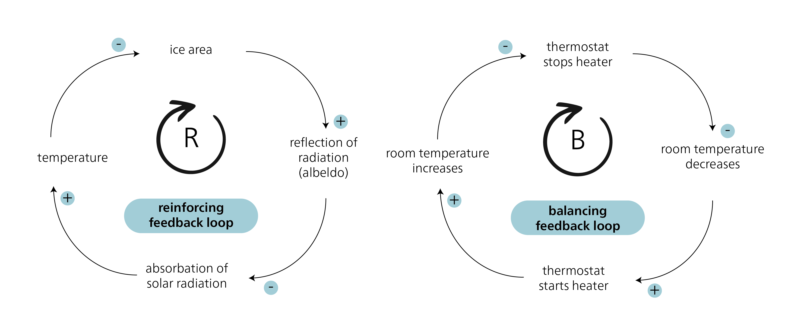
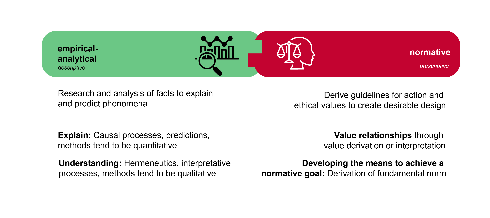
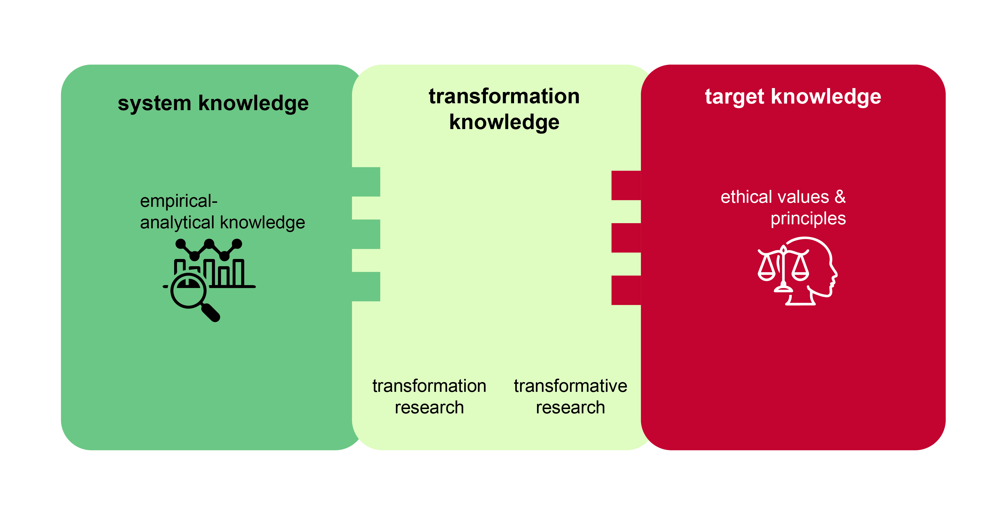

## Sustainability as a scientific discipline

What does “sustainable” mean? We could argue that sustainability means the existence and functioning – for as long as possible – of structures of various degrees of complexity. There are, in fact, many structures in the world that have existed for relatively long periods of time, such as atoms, certain ecosystems, life on Earth as a whole, or planetary systems and galaxies. But why are some structures relatively stable and able to exist “sustainably”, despite being exposed to regular disturbances that jeopardize their existence or function? Are there principles or mechanisms that could explain the continued existence of these diverse systems? And if so -- could human societies learn from these principles?

As early as the mid-20th century, scientists began to recognize that fundamental principles connect all aspects of existence, shaping the universe’s order and dynamics. A key figure in this field was Karl Ludwig von Bertalanffy (1901–1972). His research began with his reflections on the “formation of form” in nature (1928), which he further developed in publications on the structure of life (1937), molecules and organisms (1940), and biology (1949). In 1950, he introduced a theory of open systems in physics and biology, a concept that significantly influenced the development of biophysics, fluid equilibrium, and modern developmental theories. His seminal work, *General System Theory*, was published in 1968.

Systems theory laid the foundation for a revolutionary world view that not only provided explanations for the development and function of so-called systems, but also integrated isolated knowledge from various disciplines. In 1975, in a significant contribution to systems theory, Ervin Laszlo distinguished between seven different system types (physico-chemical and biological systems, organ systems, socio-ecological and socio-cultural systems, and organizational and technical systems). Today, systems theory provides the foundation for modelling complex systems and for cybernetics, which focuses on control and communication mechanisms within systems. The Club of Rome report used systems theory to analyse the growth of processes in the context of positive feedback.

### Systemic effects: Escalation and feedback

In systems theory, the mechanisms of positive and negative feedback are used to explain the dynamics and stability of systems. Positive feedback reinforces changes in a system, while negative feedback tends to balance changes, returning the system to a stable state.

{#fig-feedback}

An example of a **positive feedback loop** is Arctic albedo amplification. Arctic ice reflects a significant portion of solar radiation back into space, limiting heat absorption by the ocean. However, as the ice melts, the darker seawater absorbs more heat, further warming the ocean and causing the remaining ice to melt more rapidly. This process is self-reinforcing, as reduced ice cover lowers the albedo, which in turn leads to greater solar absorption and further melting. This positive feedback has serious consequences for the climate system, as dwindling sea ice contributes to accelerated sea level rise and shifts in oceanic and atmospheric circulation patterns. The extent and speed of this occurrence took scientists by surprise [@stroeveArcticSeaIce2007].

An example of **negative feedback** is a thermostat that regulates the temperature in a room. If the room temperature rises above the set maximum, the thermostat recognizes this and activates the air conditioning to lower the temperature. As soon as the temperature reaches the set value, the thermostat switches off the air conditioning. This control circuit maintains the room temperature at a constant level.

Positive and negative feedback often work together and can cause complex behaviour in systems. Understanding these feedback mechanisms makes it possible to better understand and predict the interactions and behaviour of systems.

## Sustainability science: origins and understanding

An emerging awareness – influenced not least by the publication, *The Limits to Growth* [@meadowsLimitsGrowthReport1972a] -- led to increased research into global environmental problems. Three major international research programmes are particularly noteworthy here: 1) the International Geosphere-Biosphere Programme (IGBP) from 1987 to 2015; 2) the World Climate Research Programme (WCRP), founded in 1980; and 3) the International Research Programme on Biodiversity (DIVERSITAS), founded in 1991 and renamed in 2014 to Future Earth. Not only did these programmes initiate important basic research -- they also provided an important impetus for greater consideration of the results in policy, as reflected, for example, in the UN’s Brundtland Report and Agenda 21. Notably, these research programmes systematically brought together previously separate disciplines of the natural sciences for the first time, although they still largely neglected the interaction between society and the environment. As the interconnectedness of these topics began to gain traction, several research projects promoting their integration were launched, particularly in the US.

> “A new field of sustainability science is emerging that seeks to understand the fundamental character of interactions between nature and society. Such an understanding must encompass the interaction of global processes with the ecological and social characteristics of particular places and sectors.” [@katesSustainabilityScience2001, pp. 641]

The concept of sustainability science was officially introduced in 2001 at the “Challenges of a Changing Earth” congress in Amsterdam, by the International Council for Science (ICSU), the above-mentioned IGBP, the International Human Dimensions Programme on Global Environmental Change (IHDP), and the above-mentioned WCRP. The German-language term “Nachhaltigkeitswissenschaft” (sustainability science) can be traced back to a translation from English.

### Understanding sustainability science

An oft used motto -- “society has problems -- universities have disciplines” -- epitomizes the conventional structure of science into various disciplines. However, disciplinary science appears to be inadequately equipped to meet the challenges of sustainable development. Two main approaches to understanding sustainability science have emerged: on the one hand, it is seen as an independent discipline with its own theories and methods; on the other, as an amalgamation of different disciplines focusing on a common theme [@clarkSustainabilityScienceEmerging2003]. While the first approach is not yet considered accurate, there is broad agreement that sustainability science should be seen as a platform that brings together science, practice, and visions – and incorporates contributions from the entire spectrum of natural, economic, and social sciences [@martensSustainabilityScienceFiction2006, pp. 38].

Sustainability science is distinct in two key ways. First, unlike traditional (“Mode 1”) research, it isn’t driven by an original scientific programme. Instead, it is guided by the normative concept of sustainability, using this as a framework for scientific analysis. Second, as a distinct type of problem-oriented research, it differs from both basic and applied research. @clarkSustainabilityScienceRoom2007 introduced the term “use-inspired basic research”, which seeks to strike a balance by seeking new knowledge while also considering its potential applications.

```{r}
#| label: tbl-mode1-mode2-science
#| tbl-cap: "Mode-1 and Mode-2 science. Source: Based on @gibbonsNewProductionKnowledge2010 and @martensSustainabilityScienceFiction2006."

library(kableExtra)
is_pdf <- knitr::is_latex_output()

df <- data.frame(
  Dimension = c("Orientation", "Disciplinarity", "Governance", "Knowledge status", "Approach"),
  `Mode-1 science` = c(
    "Academic",
    "Mono-disciplinary",
    "Technocratic",
    "Certain",
    "Predictive"),
  `Mode-2 science` = c(
    "Academic and social",
    "Trans- and interdisciplinary",
    "Participative",
    "Uncertain",
    "Exploratory"),
  check.names = FALSE
)

df |>
  kbl(booktabs = TRUE, align = "l", longtable = is_pdf) |>
  kable_styling(
    bootstrap_options = c("striped", "hover", "condensed"),
    latex_options = if (is_pdf) c("hold_position", "repeat_header") else NULL,
    full_width = !is_pdf,
    font_size = if (is_pdf) 8 else NULL
  ) |>
  row_spec(0, bold = TRUE) |>
  column_spec(1, width = if (is_pdf) "4.5cm" else NA, bold = TRUE) |>
  column_spec(2, width = if (is_pdf) "4.5cm" else NA)
```

### Empirical-analytical vs normative

As sustainable development is a normative model, it is important to distinguish between descriptive (empirical-analytical) research and prescriptive (normative) research. Descriptive statements describe the current state (“is”), while normative statements describe the ideal state (“ought”). In everyday life, the distinction between “is” and “ought” is often not recognized, but it is crucial for science.

{#fig-emprical-analytical_normative}

It is important to note that “is” and “ought” statements have different qualities and focus areas, and they cannot simply be linked without further explanation. This understanding forms the basis of Hume's law, which declares that normative statements about “what ought to be” cannot be derived from descriptive statements about “what is”. To give an extreme example: The fact that around 24,000 people starve to death every day does not allow any conclusions to be drawn as to whether this is good or bad. Without an evaluation, no normative statement can be made about whether this should be prevented. Hume pointed out that many scientists of his time often neglected this crucial distinction, and this is still the case today:

> "In every system of morality, which I have hitherto met with, I have always remark’d, that the author proceeds for some time in the ordinary ways of reasoning, and establishes the being of a God, or makes observations concerning human affairs; when of a sudden I am surpriz’d to find, that instead of the usual copulations of propositions, *is*, and *is not*, I meet with no proposition that is not connected with an *ought*, or an *ought not*. This change is imperceptible; but is however, of the last consequence. For as this *ought*, or *ought not*, expresses some new relation or affirmation, 'tis necessary that it shou’d be observ’d and explain’d; and at the same time that a reason should be given; for what seems altogether inconceivable, how this new relation can be a deduction from others, which are entirely different from it... \[I\] am persuaded, that a small attention wou’d subvert all the vulgar systems of morality, and let us see, that the distinction of vice and virtue is not founded merely on the relations of objects, nor is perceiv’d by reason.” [@humeTreatiseHumanNature1739, Book 3, Part 1, Section 1]

The realization that is and ought statements differ does not mean that scientists cannot make ought statements. Rather, it means that due to the epistemological differences between the two categories, certain rules must apply when they are linked. Hume tried to establish the relationship between these two statement types through so-called “analytic bridge principles”. Max Weber further formalized these considerations by replacing the bridge principles with the concept of “value relations”. Weber’s call for value freedom (or value neutrality) in empirical science stems from his observation that there is a clear distinction between factual questions (“is”) and value questions (“ought”) [@weberGesammelteAufsatzeZur1999, pp. 245f, 509f]. He argued that it is not the task of the empirical sciences to make value judgements. If scientists fail to make an analytical distinction between their personal values and their research goals, this could jeopardize the ability of science to produce verifiable and meaningful results [@weberGesammelteAufsatzeZur1999, pp. 150f]. In turn, it could lead to a blurring of the boundaries between scientific knowledge and knowledge from politics, religion, or everyday discussions.

Weber’s call for value freedom in empirical science was often misunderstood [@weberGesammelteAufsatzeZur1999, pp. 499f]. It does not mean that research should do without values. (Non-scientific) values have a place in empirical research, particularly in the context of sustainable development, in the following ways:

- **Values can be an object of inquiry (research object):** Values play a key role in the field of environmental and sustainability psychology, for example. In discussions about lifestyles and subjective well-being, researchers study the personal values and beliefs of individuals.

- **Values influence the choice of research topic:** Values influence the selection of research objects and questions (epistemological interest), and thus the direction of research. This is particularly relevant in application-oriented and transdisciplinary research, where the needs and information of relevant social actors are integrated into the research process, for example through *joint problem framing* or *participatory vision development* [@schneiderHowCanScience2019].

- **Value interpretations should be clearly stated:** Researchers can create value relationships, or make value interpretations [cf. @weberGesammelteAufsatzeZur1999, pp. 522]. A value interpretation, based on the hermeneutic method, concretizes the meaning of overarching value concepts and derives logical values and norms from them. For example, researchers can analyse the SDGs by examining the values underlying sustainable development. Other examples include norms derived from the concept of justice – such as the norm of human responsibility towards our environment, our social environment, and ourselves [see @michelsenNachhaltigeEntwicklungHintergruende2014, pp. 25; @schneiderHowCanScience2019]. It is important to make the original value explicit.

- **Developing the means to achieve a normative goal:** Sustainable development research often relies on value judgements to guide its pursuit of evidence-based solutions. This is comparable to political science, where normative theories aim to construct an ideal -- i.e. just -- form of government, based on the normative evaluation of what constitutes a just society. Science cannot prove the value of justice, but it can develop strategies and means to achieve this desired goal. This relationship between ends and means represents a logical connection between values and normative statements. The ultimate goal, or end, is determined by extra-scientific values. The researchers have to clearly state this relationship, and formulate their means accordingly. For example, an end–means connection could look like this: “To achieve goal X, Y is the most successful means under conditions b1, b2, and b3”. Sustainable development can be considered as an extra-scientifically given fundamental norm. For example, if research wants to make statements about how sustainable development can be achieved through solar energy, it could proceed as follows: “Switching to solar production could be a promising way of achieving sustainable development. This would organize production and distribution according to the needs of many people, minimize social inequalities, and create conditions for individual well-being.”

## Types of knowledge for sustainable development

Sustainability research focuses on challenges that threaten the long-term safeguarding of social development conditions. In the context of SD as a challenge for society as a whole, the Forum for Climate and Global Change of the Swiss Academy of Sciences has described three different types of knowledge [@proclimResearchSustainabilityGlobal1997]: systems, target, and transformation. These three knowledge types take place at three fundamental levels: 1) the analytical level, which aims to generate systems knowledge; 2) the normative level, which develops target and orientation knowledge; and 3) the operational level, which seeks to generate design or transformation knowledge. @fig-Three-Knowledge-Types shows the three knowledge types in relation to empirical-analytical and normative research.

{#fig-Three-Knowledge-Types}

**Systems knowledge** refers to the understanding of the current state. In relation to sustainable development, research examines relevant structures and processes, describing and explaining their complexity and dynamics. It uses various methods, including qualitative and quantitative approaches, mixed methods, experiments, and systems dynamics approaches. It also uses forecasts, retrospectives, and scenario analyses. Most of the studies that generate systems knowledge fall within the field of empirical research.

**Transformation knowledge** is the knowledge of how we can get from the current state (“is”) to the desired state (“ought”). This requires an integration of both systems and target knowledge. In other words, research is looking for demonstrably effective solutions to the problems identified in the context of sustainable development. There are many methods to generate transformation knowledge.

Research on transformations, i.e. the change in social organization at various levels, can be empirical as well as normative. Research focusing on past and present transformations is empirical, while research focusing on concrete goals is normative. Accordingly, the German Advisory Council on Global Change (WBGU), distinguishes between “transformation research” and “transformative research”.

Another concept that is emphasized in the context of transformations is “transformative education”, which seeks to promote skills for a comprehensive and multi-layered understanding of change [@schneidewindTransformativeLiteracyGesellschaftliche2013]. As such, transformative education aims to strengthen society’s ability to reflect on issues, for example in terms of observation and in actively shaping transformation processes.

**Target knowledge** refers to the knowledge of what should be achieved and what should be avoided. Normative research is particularly important in this context. It is about interpreting and operationalizing the values of sustainable development and deriving further standards. Research into the definition of threshold values is just as relevant as methods for assessments and visioning processes [cf. @swartProblemFutureSustainability2004; @wiekQualityCriteriaVisions2014a]. Target knowledge gives us the answer to the question of what we should transform. CDE’s study programmes are primarily guided by the following concepts of target knowledge for a sustainable economic and social system:

- The principles of sustainable development
- The 2030 Agenda and the SDGs (2015)
- The WBGU’s Flagship Report “World in Transition: A Social Contract for Sustainability” (2011)
- The Global Sustainable Development Report GSDR (2019)
