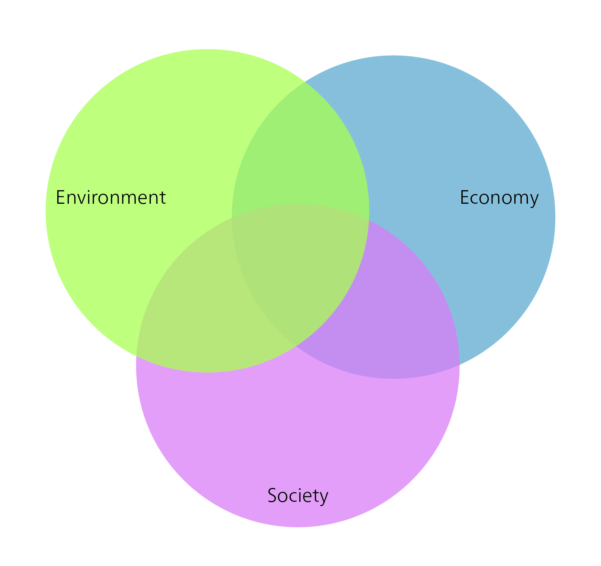
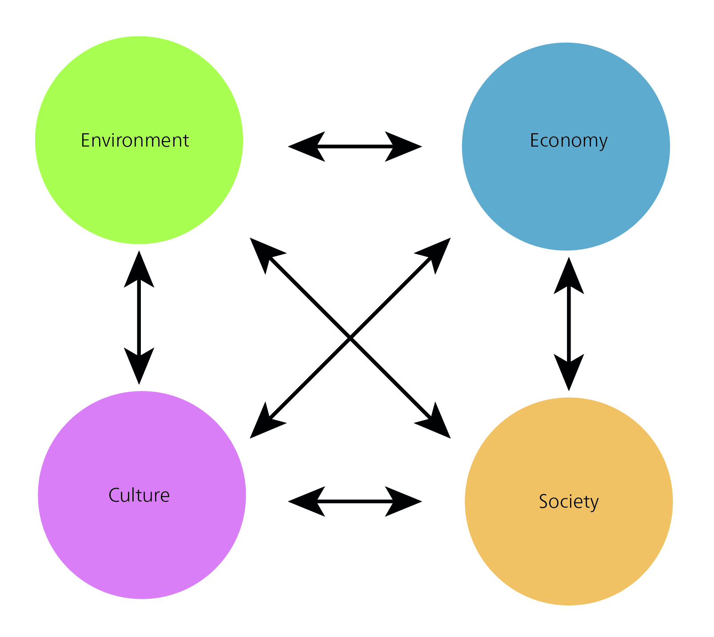
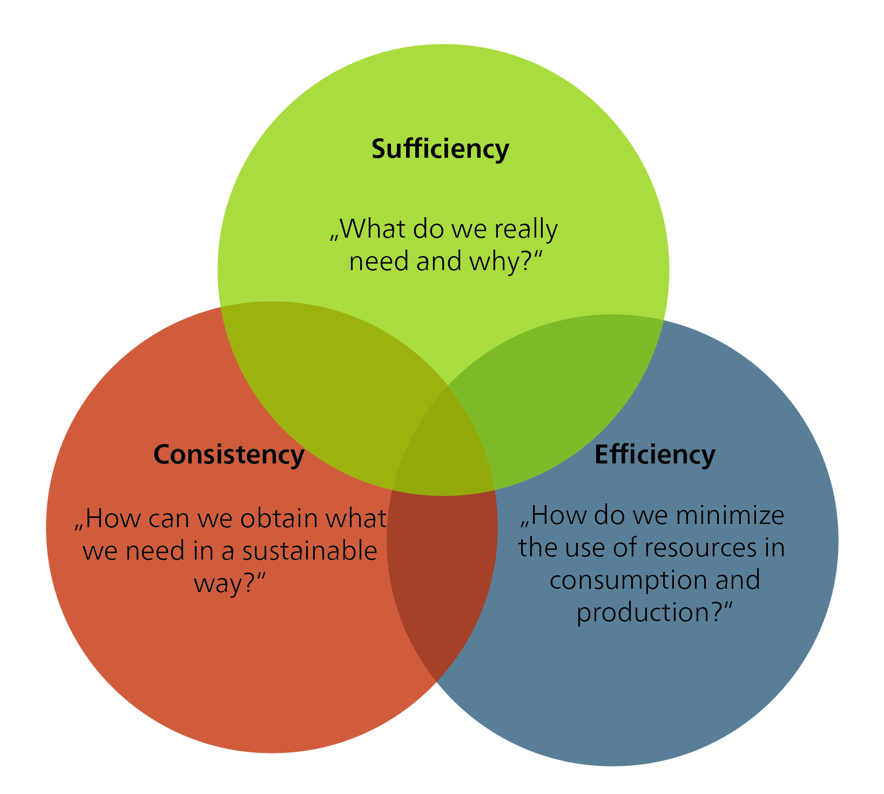
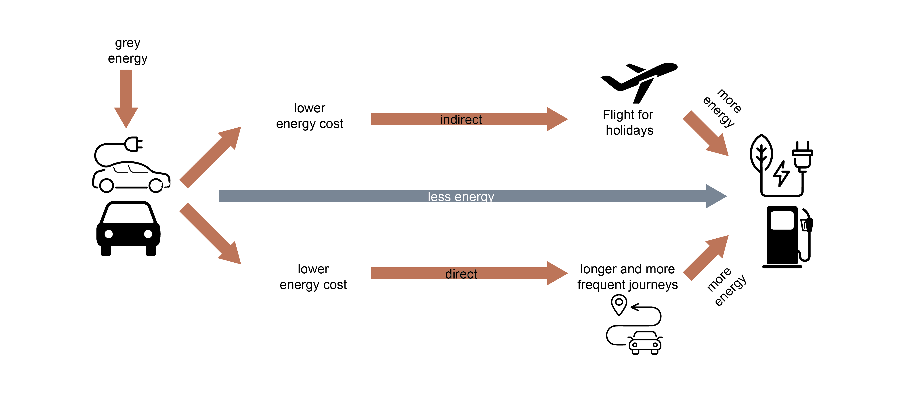

## The guiding principle of sustainable development as a normative concept

Turning the concept of sustainability into action and developing implementation strategies is a major challenge for our society. There are different understandings and concepts of sustainability and sustainable development, with no consensus on how to achieve sustainability and which measures to prioritize. Some of these understandings are presented below. The diversity of approaches reflects the different perspectives and interests of different stakeholders. To navigate this complexity, we need to reconcile economic, social, and environmental considerations. This requires an integrative approach. The challenge is to define common goals and develop strategies to achieve sustainability at all levels -- global, national, regional, and local. We need broad societal participation and dialogue, as well as cooperation between governments, business, civil society, and research institutions, to find solutions and drive the necessary change.

> “When powerful metaphors become fashionable buzzwords, we risk that diversity is accompanied by vagueness, i.e. the phenomenon of a term that has several meanings that ‘have so much in common that it is difficult to separate them’.” [@strunzConceptualVaguenessAsset2012, pp. 113; as cited in @feolaSocietalTransformationResponse2015, pp. 377]

While the concept of sustainability typically carries a positive connotation, it is subject to diverse interpretations. For it to function as a robust guiding principle across ecological, social, and economic dimensions, clear criteria are essential. However, this raises a fundamental question: on what grounds can these criteria be established?

According to @hirschhadornEthischeProblemeNachhaltiger2007, “sustainable development” should:

-   Fulfil *needs*…
-   …in a *just* way,
-   …with a view to people living today and in the future, and
-   taking into account the diversity of values and the limits to which nature can be used.

The guiding principle of sustainable development is therefore not merely a product of scientific research; it is, first and foremost, a normative, ethically grounded concept. It brings together “ethical and analytical ideas” and formulates “norms that express what is desirable and what should happen” [@rennLeitbildNachhaltigkeitNormativfunktionale2007, pp. 39]. As a result, sustainable development is a social process of negotiation and decision-making -- of searching, learning, and gaining experience -- that is guided by ethical considerations. Accordingly, sustainability research must always be aware of its involvement in social processes of perception and evaluation.

### What values and norms should we be guided by, and why?

Moving from the theoretical framework of sustainable development to its practical implementation requires the consideration of ethics. Ethics provide evaluation criteria, methodological procedures, or principles for “justifying and criticizing rules of action or normative statements about how we should act” [@fennerEthikWieSoll2008, pp. 5]. Thus, ethics provide a framework for structuring and justifying the complex decisions that arise in dilemmas. Unlike problems with a single, optimal solution, a dilemma is more complex and involves the careful weighing of trade-offs and different courses of action. The core function of ethics is therefore not to solve monocausal problems, but to structure and categorize complex dilemmas.

Put simply, “morality” refers to personal or social beliefs about right and wrong, while “ethics” is the philosophical study of these beliefs. Ethics studies the rules and principles that “ought” to govern human behaviour. Ethics can be divided into general and applied ethics (@fig-branches-ethics).

![The different branches of philosophical ethics. Source: Own illustration based on @pieperAngewandteEthikEinfuhrung1998 [pp. 9].](images/Fig1_7_EthicsBranches.png){#fig-branches-ethics}

General ethics provides us with methods and concepts to discuss fundamental moral problems. It consists of three branches: normative ethics, descriptive ethics, and metaethics. Normative ethics focuses on determining what is morally right or wrong. For example, questions about what constitutes a good life can have different answers, depending on people’s values.

For this reason, normative ethics is further divided into teleological and deontological approaches. Teleological ethics (rooted in *telos*, the Greek word for “end”, “purpose”, or “goal”) evaluates actions based on the good they produce. Utilitarianism, for example, is a teleological theory that evaluates actions based on the resulting utility or happiness. One of the first systematic elaborations of utilitarianism is Jeremy Bentham’s (1748–1832) An *Introduction to the Principles of Morals and Legislation* (1780). Deontological ethics, on the other hand, evaluates actions on the basis of their characteristics rather than their consequences. Its root is deon, Greek for “duty”. An example of a deontological ethical theory is Kantian ethics, developed by the German philosopher Immanuel Kant.

The distinction between teleological and deontological approaches is often discussed using the “trolley problem” (see further reading box below).

::: {.callout-note collapse="true"}
#### Further reading

*Justice: What’s The Right Thing To Do? Episode 01 “THE MORAL SIDE OF MURDER.”* 2009. With Michael Sandel. The Moral Side of Murder. <https://www.youtube.com/watch?v=kBdfcR-8hEY>.

Sandel, Michael. 2013. *Gerechtigkeit.* Ullstein.
:::

### The imperative of responsibility – Hans Jonas

Hans Jonas’s “imperative of responsibility ” (1979) offers an important contribution to the sustainability debate by emphasizing our ethical responsibility for future generations and for nature. Jonas’s approach, which has been described as a kind of “ethics of the future”, aims to address the new challenges posed specifically by a technological civilization. He views the concept of ethical responsibility towards future generations as an asymmetric, non-reciprocal relationship [@jonasPrinzipVerantwortungVersuch1987, pp. 177]. The asymmetry is derived from the power of a “moral subject” over someone or something that requires care; Jonas describes the vulnerability of life (ontological vulnerability) and responsibility as our duty of care to protect other beings from harm [@jonasPrinzipVerantwortungVersuch1987, pp. 391].

Jonas’s approach differs from other ethical theories in that it doesn’t take the existence of humanity for granted: instead, it includes duties towards future generations as well as to nature. Jonas argues that the first duty of an “ethics of the future” consists in recognizing the distant effects of human action [@jonasPrinzipVerantwortungVersuch1987, pp. 64]. Given the uncertainty about the long-term consequences of human action, he proposes a decision-making principle based on the Latin term, in dubio pro malo, which he interprets to mean: “\[...\] when in doubt, give the worse prognosis precedence over the better, as the stakes have become too high for the game” [@jonasPrinzipVerantwortungVersuch1987, pp. 67]. Jonas thus develops a new categorical imperative, emphasizing the need to preserve both nature and humanity. It is based on the idea that nature has an inherent value and purpose: “Act in such a way that the effects of your action are contractual with the permanence of genuine human life on earth”, or “Act in such a way that the effects of your action are not destructive to the future possibilities of such life” [@jonasPrinzipVerantwortungVersuch1987, pp. 36].

Already in the late 1970s, therefore, Hans Jonas articulated a fundamental uncertainty about the risks and harm that could arise for future generations from the technologies that were being used, such as nuclear energy. Decision-making around issues such as new technologies requires a continuous evaluation of risks and opportunities, often amid incomplete information and uncertain future forecasts. These choices not only impact the environment, but also raise ethical questions about our obligation to ensure sustainability for future generations. Jonas’ imperative of responsibility emphasizes the link between responsibility and duty as key concepts in the sustainability debate. According to Jonas, current generations have a forward-looking responsibility to future generations. He leaves open, however, the extent of this duty, and whether future generations are entitled to absolute or comparative standards.

Jonas’ imperative of responsibility can be considered in connection with various areas of responsibility that represent different ethical approaches: anthropocentrism, pathocentrism, biocentrism, and physiocentrism.

![Different ethical approaches. Source: Own illustration based on @carnauNachhaltigkeitsethikNormativerGestaltungsansatz2011 [pp. 143].](images/Anthropocentrism.jpg){#fig-anthropocentrism}

Anthropocentrism is the world view that places humans at the centre of importance, emphasizing a primary responsibility towards human society and its well-being. This includes considering the needs and interests of both present and future generations. Pathocentrism, on the other hand, extends responsibility towards all sentient beings and their well-being. It recognizes that not only humans, but also animals and other living beings, have the right to be free from suffering and harm. Biocentrism, in turn, recognizes the intrinsic value of all living organisms and focuses on the protection and preservation of biodiversity.

Hans Jonas’ imperative of responsibility reconciles all of these different areas of responsibility. It urges us to take responsibility for people as well as for other living beings, nature, and the environment. In doing so, it is important to adopt a balanced and comprehensive perspective that takes into account long-term effects and the well-being of all.

By integrating these different areas of responsibility, we can cultivate a holistic and sustainable ethic that takes due account of the needs and interests of all aspects of life and nature.

## Sustainable development in the context of development debates

Is “sustainable development” a development theory? Yes and no. No, because sustainable development is a broader social model and acts as an overarching framework that encompasses various development theories. Yes, because sustainable development is a normative theory that de facto competes in scientific and social practice with other theories of social and, in particular, socioeconomic development.

Development theories analyse social development, either retrospectively or prospectively, and either as a whole or through specific aspects (e.g. economic development). The retrospective study of social development seeks to explain past or current social developments and to draw lessons for future planning and development policy. The prospective study of social development aims to inform social development management and policy. Development theories can be categorized into different types: normative, strategic, and explanatory theories. Each type focuses on different aspects and objectives of development research.

Normative theories focus on the question of what development should look like, and what normative goals it should achieve. They examine values and goals associated with development, often referring to concepts such as social justice, sustainability, or poverty alleviation. Normative theories emphasize the definition of criteria for good development, and provide a normative framework for policy decisions and measures. Examples include the theory of sustainable development, John Rawls’ theory of social justice, or Amartya Sen’s capability approach.

Strategic theories investigate which strategies and measures are needed to achieve desired development outcomes. They focus on questions of policy design, resource allocation, and the implementation of measures, analysing how specific approaches, such as neoclassical growth theory, can promote development.

Explanatory theories aim to explain the causes and mechanisms of development. They analyse factors that drive development processes in societies and study the links between the different variables. This involves examining economic, social, political, or cultural factors to identify patterns and connections. Examples include modernization theory and dependency theory.

Note: All theories are based on normative foundations -- i.e. underlying values and beliefs -- and therefore imply, even unintentionally, certain ideas about how society should develop.

+:-----------------+:---------------------------------------------------------------------------------------------------------------------------------------------------------------------------------------------------------------------+:--------------------------------------------------------------------------------------+:--------------------------------------------------------------------------------------------------------------------------------------------------------------------------------------+:---------------------------------------------------------------------------------------------------------------------------------------------------------------------------------------------+:-------------------------------------------------------------------------------------------------------------------------------------------------------------------------------------+
|                  | **1950s/60s**                                                                                                                                                                                                        | **1970s**                                                                             | **1980s**                                                                                                                                                                             | **1990s**                                                                                                                                                                                    | **Since 2008**                                                                                                                                                                       |
+------------------+----------------------------------------------------------------------------------------------------------------------------------------------------------------------------------------------------------------------+---------------------------------------------------------------------------------------+---------------------------------------------------------------------------------------------------------------------------------------------------------------------------------------+----------------------------------------------------------------------------------------------------------------------------------------------------------------------------------------------+--------------------------------------------------------------------------------------------------------------------------------------------------------------------------------------+
| **Narrative**    | Economic growth, modernization, and integration into the world economy                                                                                                                                               | Fight against extreme poverty and inequality                                          | Lost decade: collapse of commodity prices; increase in debt                                                                                                                           | Sustainable development; decade of hope                                                                                                                                                      | Polycrisis                                                                                                                                                                           |
+------------------+----------------------------------------------------------------------------------------------------------------------------------------------------------------------------------------------------------------------+---------------------------------------------------------------------------------------+---------------------------------------------------------------------------------------------------------------------------------------------------------------------------------------+----------------------------------------------------------------------------------------------------------------------------------------------------------------------------------------------+--------------------------------------------------------------------------------------------------------------------------------------------------------------------------------------+
| **Basic idea**   | Catch-up development through industrialization and large-scale projects                                                                                                                                              | Satisfaction of basic needs, growth, and effective distribution                       | Overcoming the debt crisis through structural adjustment measures, reduction of state services                                                                                        | Global and sustainable environmental policy, economic growth, peacekeeping, continuing basic needs strategy, participation                                                                   | Bringing together various crisis phenomena (financial crisis, climate change, biodiversity crisis, etc.) and examining their complex interrelations; search for integrated solutions |
+------------------+----------------------------------------------------------------------------------------------------------------------------------------------------------------------------------------------------------------------+---------------------------------------------------------------------------------------+---------------------------------------------------------------------------------------------------------------------------------------------------------------------------------------+----------------------------------------------------------------------------------------------------------------------------------------------------------------------------------------------+--------------------------------------------------------------------------------------------------------------------------------------------------------------------------------------+
| **Theories**     | Modernization theories (stage theories)                                                                                                                                                                              | Dependency theories versus modernization theories                                     | Market liberalism and neoliberalism                                                                                                                                                   | \- Theories of sustainable development   - Neoclassical growth theory   - Postcolonial theories   - Capability approach   - Post-development theories                            | Additional resilience theories, post-growth theories                                                                                                                                 |
+------------------+----------------------------------------------------------------------------------------------------------------------------------------------------------------------------------------------------------------------+---------------------------------------------------------------------------------------+---------------------------------------------------------------------------------------------------------------------------------------------------------------------------------------+----------------------------------------------------------------------------------------------------------------------------------------------------------------------------------------------+--------------------------------------------------------------------------------------------------------------------------------------------------------------------------------------+
| **Goals**        | Geopolitical classification of the “Third World”; containment of communism, modernization of agriculture, rapid industrialization and technological progress, opening up of new markets                              | Aid for self-help, appropriate technologies, rural development, promotion of women    | Increase in exports, balanced state budgets                                                                                                                                           | Paradigm shift in development aid towards development cooperation, environmental and social compatibility of development, ensuring access to resources and infrastructure for all            |                                                                                                                                                                                      |
+------------------+----------------------------------------------------------------------------------------------------------------------------------------------------------------------------------------------------------------------+---------------------------------------------------------------------------------------+---------------------------------------------------------------------------------------------------------------------------------------------------------------------------------------+----------------------------------------------------------------------------------------------------------------------------------------------------------------------------------------------+--------------------------------------------------------------------------------------------------------------------------------------------------------------------------------------+
| **Consequences** | Economic dependence and indebtedness increase, income disparities widen, poverty rises, ecological damage due to overuse and inappropriate technologies, undemocratic regimes are supported for geopolitical reasons | Selective progress in education and health, problems of debt and environmental damage | Living standards of the poorest population groups deteriorate severely, environmental exploitation, debt spiral, increase of dependency of the Global South on Global North countries | Focus shifts from purely economic development to human development; industrialized countries are obliged to implement sustainable development; emergence of a global development partnership |                                                                                                                                                                                      |
+------------------+----------------------------------------------------------------------------------------------------------------------------------------------------------------------------------------------------------------------+---------------------------------------------------------------------------------------+---------------------------------------------------------------------------------------------------------------------------------------------------------------------------------------+----------------------------------------------------------------------------------------------------------------------------------------------------------------------------------------------+--------------------------------------------------------------------------------------------------------------------------------------------------------------------------------------+

: Overview of Development Debates. Source: Extended table based on Egli et al. (2022), p. 378 {#tbl-development-debates}

::: {.callout-note collapse="true"}
#### Development theories

**Modernization theory** (1950s–1980s) emphasizes the transition from traditional societies to modern, industrialized societies as the basis for development. For proponents of modernization theory, the countries of the Global South are developing in the same direction as industrialized countries, but at a much slower pace. Modernization theory values economic growth, technological progress, and institutional adjustments. It is often associated with stage theories, which emerged in the 1950s and 1960s. Stage theories view development as a gradual process characterized by clearly defined stages or phases of development, with emphasis on economic growth and modernization. Prominent proponents include Walt Rostow, who identified five stages of development in his work, *The Stages of Economic Growth: A Non-Communist Manifesto* (i.e. traditional society, preconditions for take-off, take-off, drive to maturity, and mass consumption).

**Dependency theory** (1970s and 1980s) emphasizes the structural dependence and inequality between developed and developing countries. It argues that developing countries are trapped in an unjust global economic system and remain dependent on developed countries.

**Neoclassical growth theory** (as of the 1990s) focuses on the connection between capital accumulation, technological progress, and economic growth. It emphasizes free markets, trade, and investment as drivers of development.

**Postcolonial theories** (as of the 1990s) emphasize the historical and structural inequality between former colonial powers and colonies. They argue that development can only be achieved through a critical examination of the legacy of colonialism.

**Sen’s capability approach** (as of the 1990s) emphasizes the importance of freedom, social justice, and human development. It emphasizes the necessity to improve the opportunities and capabilities of people to achieve development.

**Post-development theories** (as of the 1990s) criticize linear development models that impose Western ideas of progress, emphasizing instead local practices and values. Prominent thinkers in this field include Arturo Escobar, who critically reflects on the idea of development in his work *Encountering Development: The Making and Unmaking of the Third World*, and Vandana Shiva, whose *Decolonizing the North* calls for sustainable and fairer development policies in the Global South that reduce the influence of the Global North.
:::

## Sustainability models

### Three dimensions of sustainability

The established three-sector model of sustainability, introduced in the 1987 Brundtland Report, seeks to balance environmental, economic, and social concerns. This model, which later also became known as the “triple bottom line” model, emphasized that economic development should be profitable while ensuring that environmental and social impacts remain neutral. On closer inspection, however, the model -- initially depicted as a building with three pillars -- has a major weakness. It was intended to suggest that if any one pillar was weak, the system as a whole would be unsustainable. However, it could be argued that removing one of the pillars -- or even the two outer pillars -- would not make the building collapse if the remaining pillar(s) were strong enough. Despite its widespread use and overall success, the model struggles with transparency and equity. For example, while economic success is easily measured through quantitative indicators, it is more challenging to find similar metrics for social well-being, especially regarding its emotional aspects. Some critics argue that the model prioritizes conventional economic thinking, neglecting important social aspects. An overemphasis on human economic systems can also prevent us from seeing our dependence on non-human ecological systems.

### Sustainability as an intersection

{#fig-sustainability-intersection}

A model displaying the three sectors as a Venn diagram (overlapping rings or circles, sometimes known as the intersection or triad model) offers an alternative to the separate pillars, emphasizing the interconnectedness of the three dimensions. This model illustrates that there can be a closer connection between two areas, and that the boundaries are fluid.

### Nested sustainable development

@giddingsEnvironmentEconomySociety2002 challenge the idea of separate spheres for the economy, society, and environment. They propose a “nested” model, where the economy is seen as part of society, which in turn is embedded in the environment. This model, they argue, ensures that economic decisions are always constrained by social and environmental factors. Global ecosystems form the basis for social systems (i.e. society). Embedded therein is the economy, which serves society’s needs. A potential drawback of this model, however, is that if the economy is the starting point for all sustainability considerations, there is a risk of prioritizing it over social and environmental considerations.

![The nested model of sustainability. Source: Own illustration based on @giddingsEnvironmentEconomySociety2002 [pp. 192].](images/sustainability-nested.jpg){#fig-sustainability-nested}

### A four-dimensional model of sustainability

One problem with the three-sector model of sustainability is that that it is unclear what falls within the broad “social” sphere. It has therefore been suggested that a fourth dimension be added, to emphasize certain aspects that might otherwise remain hidden in the social sector. For example, Jon Hawkes, an Australian cultural commentator, has suggested adding “cultural vitality” as a fourth pillar of sustainability, in addition to environmental, economic, and social concerns.

{#fig-sustainability-4-dimensions}

Cultural sustainability is often seen as a part of social sustainability. Sometimes the term “sociocultural sustainability” is also used. In this context, “culture” refers to aspects such as equity, opportunities for participation, awareness of sustainability, and general operating and behavioural models [@murphySocialPillarSustainable2012]. It’s clear that the social and cultural dimensions are closely linked. Cultural processes influence our social lives and how we view social sustainability, like the value we place on equality as a social goal. In turn, social structures and institutions influence cultural practices and judgements. Despite this strong connection, cultural and social sustainability can also be seen as separate dimensions or perspectives of sustainability.

Culture does not have its own Sustainable Development Goal (SDG). In the 2030 Agenda, culture is mentioned in relation to “civilization”, “diversity”, “interculturality”, “cultural heritage”, and “tourism”, under the following four SDGs: quality education (SDG 4), decent work and economic growth (SDG 8), sustainable cities and communities (SDG 11), and responsible consumption and production (SDG 12) [@duxburyCulturalPoliciesSustainable2017].

The concept of cultural sustainability can be interpreted in various ways: as the fourth dimension of sustainability, as culture for sustainability, and as culture as sustainability. The interpretation of “culture as sustainability” requires a new way of thinking and a new paradigm in relation to sustainability. In this view, culture itself is transformed towards sustainability. Cultural sustainability here means thinking about what needs to be preserved, what needs to change, and how we can implement these changes. This interpretation -- viewing culture as sustainable development -- defines culture in its broadest sense: as a comprehensive way of life and a continuously changing process. Our social order (such as capitalism and democracy), our values, and our ways of working are all cultural products. Culture thus encompasses all the other dimensions of sustainability, and transforming it becomes a key concern for sustainability.

The definition of cultural sustainability contains several important aspects: Firstly, it emphasizes the importance of intellectual growth and responsibility. This means acquiring knowledge, developing a better understanding of important issues, and participating in educational activities and events. It also means acting not only as individuals, but also as members of different communities. All problematic and unsustainable structures and operating models have been created and developed by humans. We humans, therefore, also have the opportunity to change them.

Cultural sustainability is required, for example, for a “Great Transformation” as advocated by Uwe Schneidewind [-@schneidewindGrosseTransformationEinfuhrung2018]. In his work, Schneidewind emphasizes the need for comprehensive change in all dimensions of society, including culture, in order to achieve sustainable development. Recognizing cultural sustainability as a central paradigm of sustainability supports the vision of a comprehensive transformation that goes beyond technological and economic solutions and strives for a fundamental societal change of course.

## Weak and strong sustainability

The academic debate on sustainability distinguishes between weak and strong sustainability [see e.g. @ottNachhaltigkeit2020]. Neither concept can easily be dismissed, as both rely on assumptions that are difficult to refute. In practice, both concepts are considered partially true, with evidence both in favour and against. The key difference between weak and strong sustainability is the question of what we should sustain, and the degree to which what forms of capital can be substituted. This concerns, in particular, the following three forms of capital: natural capital, manufactured capital, and human capital.

**Natural capital**: the natural resources and ecosystems that are key to human well-being and sustainable development. These include land, water, air, biodiversity, and renewable energy. Natural capital is the basis for many economic activities, and it provides essential ecosystem services such as food, the purification of water and air, and cultural and aesthetic benefits.

**Manufactured capital**: the material resources and infrastructure used in production and economic activity. This includes buildings, machinery, technological equipment, means of transport, and physical infrastructure. Manufactured capital is closely linked to economic growth and productivity, and it plays an important role in economic development.

**Human capital**: the knowledge, skills, level of education, health, and creative abilities of people in a society. It encompasses individual and collective knowledge as well as the skills needed for economic productivity and social progress. Human capital is important for innovation, labour productivity, social participation, and the ability of a society to tackle challenges and to adapt.

### Weak sustainability

Weak sustainability can be considered the “soft” or flexible option. Supporters of weak sustainability believe that an action is sustainable if it offers an advantage to the overall system, or at the very least, does not reduce its quality. Weak sustainability can therefore be seen as a basic requirement of sustainability, in that it aims to maintain a certain level of well-being and quality of life while ensuring equity. The concept of weak sustainability “assumes the extensive and, at least in principle, unlimited \[...\] substitutability of all types of capital” [@ottTheorieUndPraxis2004, pp. 41] and is thus based on the premise of neoclassical economics. Proponents of weak sustainability believe that natural capital can be substituted with other forms of capital. They emphasize the concept of “total capital”, arguing that the specific make-up of the capital inherited by future generations is irrelevant, as long as the overall benefits and well-being are sustained. This aligns with neoclassical utility theory, according to which it is irrelevant how utility is generated.

Weak sustainability supporters therefore believe that measures can be considered sustainable, even if they are carried out at the expense of natural capital – as long as this loss is compensated for by an increase in human or manufactured capital. This could justify the extraction of raw materials such as coal or excessive crude oil. And Carlowitz’s *Silvicultura oeconomica* forest, could, in principle, also be replaceable or degradable, provided that its natural and cultural functions can be fulfilled in other ways by future generations. This understanding of sustainability emphasizes the importance of technological progress for sustainable development.

Evaluating measures based on weak sustainability is challenging, due to the inherent complexities and numerous assumptions involved. This goes beyond fundamental questions about sustainability, such as “What is a good life?”, or “How do we measure the level of well-being?”. A key challenge lies in assigning a monetary valuation to different types of capital, especially those lacking a clear market price. To operationalize this, what factors should be taken into account? What is the value of natural beauty? What is the value of a rare bird or a whale? Buller’s *The Value of a Whale* [-@bullerValueWhaleIllusions2022] impressively outlines the problems we face in trying to put a price on elements of nature.

Critics of the concept of weak sustainability point to several limitations. Firstly, they question the assumption that natural resources can be endlessly replaced by reproducible capital. Secondly, they doubt whether an increase in goods can truly compensate for the loss of environmental quality. Finally, concerns exist about our ability to develop new resources and the potential for exceeding critical threshold values. These criticisms have paved the way for the concept of “strong sustainability”.

### Strong sustainability

In contrast to weak sustainability, strong sustainability emphasizes the preservation of natural capital. Proponents of this eco-centric theory are less optimistic about our ability to substitute natural resources with manufactured ones, believing these resource types to have limited interchangeability [@dalyOperationalPrinciplesSustainable1990; @ottTheorieStarkerNachhaltigkeit2001; @ottTheorieUndPraxis2004]. They argue that the individual elements of natural capital should be kept as constant as possible, to prevent, for example, species extinction.

::: {.vsmall-table latex-environment="vsmall"}
+-------------------------------+-----------------------------------------------------------------------------------+------------------------------------------------------------------------+---------------------------------------------------------------------------+-------------------------------------------------------------------------+
| **Category**                  | **Very Weak Sustainability**                                                      | **Weak Sustainability**                                                | **Strong Sustainability**                                                 | **Very Strong Sustainability**                                          |
+:==============================+:==================================================================================+:=======================================================================+:==========================================================================+:========================================================================+
| **What should be preserved?** | Total capital                                                                     | Essential natural capital                                              | Non-renewable natural capital                                             | Nature has its own value                                                |
+-------------------------------+-----------------------------------------------------------------------------------+------------------------------------------------------------------------+---------------------------------------------------------------------------+-------------------------------------------------------------------------+
| **Why?**                      | Maximization of economic profit and individual welfare (GDP)                      | \+ Limitation of environmental damage and resource scarcity            | Ensuring long-term living conditions for humans and nature                | \+ Respect for all forms of life and duties toward nature               |
+-------------------------------+-----------------------------------------------------------------------------------+------------------------------------------------------------------------+---------------------------------------------------------------------------+-------------------------------------------------------------------------+
| **How?\                       | Growth orientation through promotion of technology and innovation                 | Environmental regulations, resource efficiency, renewable energies     | \+ Conservation measures, ecological restoration, sustainable agriculture |                                                                         |
| (Policies)**                  |                                                                                   |                                                                        |                                                                           |                                                                         |
+-------------------------------+-----------------------------------------------------------------------------------+------------------------------------------------------------------------+---------------------------------------------------------------------------+-------------------------------------------------------------------------+
| **Substitutability**          | In principle unlimited, natural resources can be replaced by technology and trade | Partly possible, but limited substitutability of ecosystem services    | Limited, critical threshold for environmental changes                     | Low, recognition of unique values and relationships                     |
+-------------------------------+-----------------------------------------------------------------------------------+------------------------------------------------------------------------+---------------------------------------------------------------------------+-------------------------------------------------------------------------+
| **Ethics**                    | Anthropocentric, short-term benefits take priority                                | Anthropocentric with stronger consideration of environmental interests | Pathocentrism, recognition of intrinsic value of nature                   | Biocentrism, ecological integrity, ethical responsibility toward nature |
+-------------------------------+-----------------------------------------------------------------------------------+------------------------------------------------------------------------+---------------------------------------------------------------------------+-------------------------------------------------------------------------+

: Weak and Strong Sustainability. Source: Derived from @eblinghausNachhaltigkeitUndMacht1998; @michelsenStudienbriefGrundlagenNachhaltigen2012; @daviesAppraisingWeakStrong2013. {tbl-weak-strong-sustainability}
:::

While neoclassical economists are confident about substitution, proponents of strong sustainability emphasize the importance of prevention and anticipation, rather than aftercare and reaction. For example, reacting to the hole in the ozone layer by using sun cream, protective clothing, or medical aftercare fails to tackle the cause of the problem. Similarly, technological approaches such as geo-engineering are criticized for merely treating problems superficially. Geo-engineering refers to technical interventions in geochemical or biogeochemical cycles, for example to slow down climate change or ocean acidification.

Until now, reducing pollution has mainly focused on end-of-pipe technologies, such as flue gas cleaning systems on factory chimneys or catalytic converters in cars. But this also meant that we put off tackling long-term environmental problems, such as climate change or biodiversity loss, as long as their effects were not immediately apparent. This phenomenon is linked to the concept of externalization, in which environmental and social costs are shifted outwards, as described by @lessenichNebenUnsSintflut2018. This means that pricing only takes into account the economic costs, partly because they are easier to quantify, while the social and environmental costs of providing goods and services are omitted or externalized, leading to distortions in market prices.

## Sustainability strategies as principles of sustainable development

{#fig-sustainability-strategies}

### Efficiency strategy

The efficiency strategy focuses on minimizing resource use (i.e. raw materials and energy) in manufacturing or service provision. This translates to reducing material consumption (material intensity), energy consumption (energy intensity), and emissions of harmful substances such as CO~2~. Also known as “eco-efficiency”, this strategy is attractive to business and society, as it can reduce costs, resource use, and environmental impact. Implementing the efficiency strategy starts with improving production processes, primarily through technological advancements. Proponents believe it’s possible to double prosperity while halving natural resource use [@vonweizsackerFaktorVierDoppelter1995]. However, critics of the efficiency strategy are less optimistic, and caution against overestimating its impact on sustainable economic activity. They point to “rebound effects”, which can reduce or even wipe out the gains from efficiency increases [@paechBefreiungVomUberfluss2012; @santariusReboundEffektBlinderFleck2014].

::: {.callout-tip collapse="true"}
#### Putting Efficiency Strategies into Action: Examples

**Energy-efficient lighting**: Replacing conventional lightbulbs with energy-efficient LED bulbs lowers electricity use and helps reduce the demand for energy.

**Fuel-efficient vehicles**: The development of more fuel-efficient hybrid or electric vehicles can lead to lower fuel consumption and road transport emissions.

**Efficient building technology**: Installing smart HVAC (heating, ventilation, and air conditioning) systems in buildings helps to reduce energy consumption for heating and cooling.

**Efficient water use**: The use of water-saving fittings and systems in households and industrial companies reduces water consumption and minimizes waste.
:::

### Consistency strategy

While the efficiency strategy focuses on quantity (reducing resource use while achieving greater output), the consistency strategy (from the Latin con = together + sistere = to stop) strives to reconcile nature and technology by using resources repeatedly instead of only once. Instead of fossil fuel-based resources, products, and technologies, it seeks to use materials that are compatible with natural material cycles and processes. Also referred to as “eco-effectiveness”, this concept follows the principle of “cradle to cradle” rather than “cradle to grave”, and is based on the idea that intelligent systems generate only products, not waste. This can be achieved in two ways: Materials can either be biodegradable (e.g. a shampoo made with natural ingredients), or they can be designed with “technical nutrients” that remain in the technical cycle. This means that a disused product doesn’t end up in the rubbish, but instead enters the next cycle of use, for example through upcycling (e.g. reusing a computer casing or converting into, say, a shelving system). Like the efficiency strategy, the consistency strategy also starts by looking at how production processes can be optimized. Many believe that the consistency strategy has greater potential than the efficiency strategy, in terms of problem solving and achieving far-reaching changes.

However, critics believe the theory has limited applicability. For example, Gerolf Hanke and Benjamin Best [-@hankeEnergiewendeAusWachstumskritischer2013] argue that it cannot be applied equally to every type of good, and that implementing technologies to achieve it would require significant investment in production facilities and logistics. They also note that recycling processes themselves are associated with increased energy consumption, in accordance with the law of entropy:

> “Every material economic process results in an increase in entropy, i.e. roughly simplified, that the elements on the material level are distributed more and more evenly, which ultimately only means that things and bodies wear out and a new concentration requires an ever-increasing amount of energy.” [Translated from @hankeEnergiewendeAusWachstumskritischer2013, pp. 11]

A special feature of the Earth’s ecosystem is solar energy, which provides a constant supply of energy from the outside and counteracts the increase in entropy on Earth. But we still need what is known as “grey energy” to manufacture energy generation systems, e.g. biofuel systems, solar cells, electric car batteries, and wind turbines. Consistency strategies can incentivize industry to strive for a reduction in resource consumption and emissions.

::: {.callout-tip collapse="true"}
#### Putting Consistency Strategies into Action: Examples

**Renewable energy systems**: The transition from fossil fuels to renewable energy sources such as solar energy, wind energy, and hydropower is an effort to align energy production with the natural rhythms and cycles of the environment.

**Recyclable electronics**: Designing electronic devices in a way that makes it easy to repair,
upgrade and recycle them, to minimize resource consumption and environmental impact.

**Sustainable construction**: Constructing buildings using sustainable materials that have a low environmental impact and can be reused or recycled at the end of their useful life.
:::

### Sufficiency strategy

The concept of sufficiency, rooted in the Latin word sufficere (to suffice), challenges our assumptions about how much we need for a good life. It seeks to reduce resource and energy consumption by focusing on reducing the demand for resource-intensive goods and services. Sufficiency, which could also be described as frugality or adequacy, is critical of the constant creation of new needs through technology and advertising, especially given the limited supply of natural resources. Sufficiency urges us not to chase after every newly created need, and to fulfil our needs without consumption. While efficiency and consistency strategies focus on production, sufficiency focuses on consumption, albeit not exclusively: sufficiency can be practised to varying degrees and at different levels, from small changes in behaviour (sharing instead of buying) to significant changes in lifestyle (giving up air travel). Although it starts at an individual level, sufficiency can be applied at various levels, such as by companies (sufficiency-oriented product design) and governments (sufficiency policies). Sufficiency therefore seeks the right balance: How much do we need for a good life? And what do we not need?

Critics believe the sufficiency strategy has only limited potential and is unlikely to find broad sociocultural acceptance. However, proponents see it as crucial for sustainability policy, especially where efficiency and consistency strategies fall short. The concept of a post-growth economy draws on the principles of the sufficiency strategy.

::: {.callout-tip collapse="true"}
#### Putting Sufficiency Strategies into Action: Examples

**Sharing and communal use**: Platforms and initiatives for sharing objects, tools, or vehicles make it possible to use resources more efficiently and reduce the number of products manufactured.

**Plant-based diet**: A predominantly plant-based diet is less resource-intensive than a meat-based one.

**Reduction in working hours**: Shortening the workweek can lead to a decrease in resource consumption, as producing fewer goods and services will save on energy and raw materials.

**Buy local**: Supporting local producers and markets helps to reduce transport routes and emissions.
:::

### The Rebound Effect: A flipside of efficiency

::: {#rebound-effect layout-ncol="2"}
{target="_blank"} on LinkedIn.](images/rebound-effect-fietsprofessor.jpg){#fig-rebound-effect-fietsprofessor}

> “Any intelligent fool can make things bigger, more complex, and more violent. It takes a touch of genius -- and a lot of courage to move in the opposite direction.” [@schumacherSmallBeautifulEconomics1973]
:::

Critics of the efficiency principle warn of the rebound effect, also known as the Jevons paradox (Jevons 1865/1965). This phenomenon occurs when efficiency improvements lead to lower prices for goods and services, thus increasing demand and negating the initial benefits of lower resource use.

Take this simple example: If passenger cars become cheaper due to improvements in efficiency, then people may choose a larger model when they next purchase a car. In addition, a fuel-efficient car is cheaper to run, as it requires less fuel per kilometre. This usually incentivizes people to drive more (either by making more frequent journeys or travelling longer distances) and reduce their use of public transport or their bicycle. As a result, efficiency gains that are technically possible are often not realized in practice, as the product in question is used more frequently or more intensively. Apart from the direct change in the use of the product (direct rebound), there may be additional changes in consumer behaviour that affect the environment. In this example, this could mean that the money saved on purchasing or using the car is spent on air travel instead (indirect rebound), which in turn cancels out some of the environmental benefits.

{#fig-rebound-effect}

To understand the rebound effect, the literature focuses on the following three areas: 1) financial factors, 2) socio-psychological influences, and 3) regulatory effects, which we analyse in more detail below.

1.  Financial factors are a major cause of the rebound effect. When efficiency leads to cost savings, financial resources are freed up. This can lead to people either consuming more of the same product (direct rebound effect) or investing in alternative goods (indirect rebound effect). The financial rebound effect can be based on several factors, including:
    -   The income effect: when efficiency leads to real income gains for consumers, it can result in a direct or indirect rebound effect.

    -   The reinvestment effect: when companies use cost savings to expand their production or invest in other products.

    -   The market price effect: the macroeconomic effect in which demand in one sector stimulates demand in other sectors. For example, as cars become more efficient, demand for fuel may fall, making fuel cheaper and affecting demand in other energy-consuming sectors.

The extent and intensity of the financial rebound effect depend on factors such as price elasticity and consumer behaviour. While this happens at the individual level, it can cumulate into a macroeconomic market price effect with far-reaching consequences.

2.  Socio-psychological influences include the “mental accounting” of individual consumers. For example, consumers who have purchased an efficient product may “allow themselves” to consume more. This is why increases in the efficiency of products that were previously considered harmful to the environment can, paradoxically, lead to an increase in consumption. This direct rebound effect is often referred to in social psychology as the “moral hazard effect”. If the decision to increase consumption is not made rationally, this is known as the “moral leaking effect”. For example, if you drive more after buying a resource-efficient car, because the purchase alone is perceived as environmentally conscious. The indirect rebound effect can also be attributed to socio-psychological factors. The “moral licensing effect” states that the purchase of resource-efficient products can lead to an increase in the consumption of other products that may be harmful to the environment. For example, when the purchase of a fuel-efficient car is used to justify more frequent air travel.

3.  3.	Sometimes, government regulations or incentives to promote efficient technologies can have unintended consequences – this is what we mean by the “regulatory effect”. For example, if people are encouraged to purchase large electrical appliances devices due to government incentives for energy-efficient models. Such incentives may result in more frequent purchases of appliances, which – even if the newer model is more efficient than the old – partially cancels out the energy-savings effect. Furthermore, the introduction of efficiency technologies leads to new capacities and infrastructures, which can result in the creation of new markets. Wind turbines, for example, promote the development of new infrastructures and jobs, but at the same time require considerable resources. In addition, consumers who purchase a more efficient product may not necessarily discard their old product. Some end up using both products, representing an increase in overall consumption [@santariusReboundEffektBlinderFleck2014].

::: {.callout-note collapse="true"}
#### Rebound effects

The **direct rebound effect** occurs when improved energy efficiency makes it cheaper to consume a resource, leading people to consume more of it. For example, a more fuel-efficient car would be cheaper to run. This might encourage people to drive more, partially or completely cancelling out the energy savings from the efficiency increase.

The **indirect rebound effect** occurs when energy savings or resource efficiency gains in one area lead to the use of the freed-up resource in another area. This reduces the overall savings achieved. For example, if the money saved from more energy-efficient living is used instead for more frequent flying.
:::

### How big is the rebound effect?

It is difficult to know exactly how big the rebound effect is: empirical estimates vary widely, depending on the methods used and the effects taken into account. It is particularly challenging to clearly distinguish rebound effects from growth or structural changes. The type of product or service also influences the magnitude of the rebound effect. For example: If a commuter switches to a more efficient car, their costs decrease, but their available time remains fixed. Because a day contains only 24 hours, the commuter cannot increase their commuting time indefinitely. The rebound effect in this scenario is therefore relatively small. The situation is different for leisure activities, such as travelling by air. If costs fall due to more efficient aircraft or cheaper prices, there is a greater incentive to fly more often -- for example, taking a second weekend trip instead of just one per year. As time is not such a tight constraint here, additional consumption can increase significantly -- as can the rebound effect. Another important component is the degree of saturation with goods and services. Observations show that rebound effects tend to be lower in high-income countries than in developing countries, where there is still a considerable need for additional consumption.

For example, the direct rebound effects associated with improved space heating efficiency can result in energy savings being 10-30% lower than what is technically achievable [e.g. @hedigerTurnItOpen2018]. The rebound effects of transport vary even more. According to @anderssonEstimatingCarUse2019, the rebound effect related to private mobility might reduce potential savings by 7.5% in Denmark, 30% in Sweden, and 60% in Germany. In contrast, studies on lighting in private households have found very low rebound effects, of less than 10% [@sorrellReboundEffectAssessment2007]. Consequently, actual energy savings for these services are, on average, up to 25% lower than what is technically possible and predicted. Ultimately, the magnitude of the rebound depends on the specific context and can be mitigated through targeted policy measures.

This means that the actual energy savings for these services can be, on average, up to 25% less than what is technically possible and predicted. However, the exact magnitude of the rebound depends on the specific context and can be reduced by choosing appropriate measures.

Sometimes, albeit rarely, the savings may be overcompensated. This is known as the “backfire” effect. However, this is an exception, and the “backfire” effect is not a pure rebound effect, as it is linked to the effects of growth and structural change. A good example is digitalization, which can lead to short- and medium-term backfire effects [@pengEnergyReboundEffect2023].
